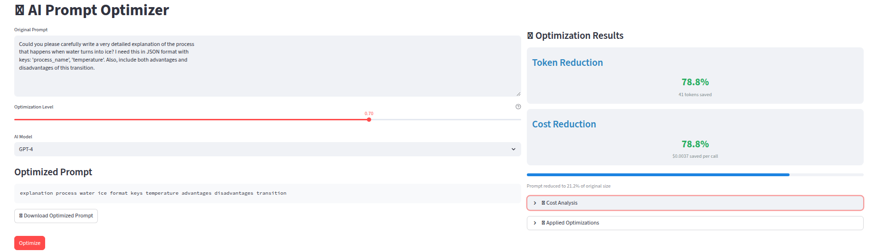
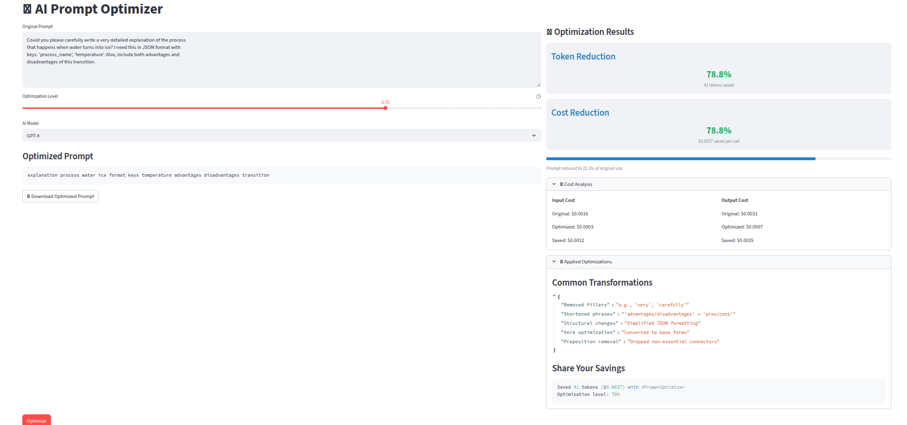

# 🚀 AI Prompt Optimizer

**AI Prompt Optimizer** is a Streamlit-based tool that intelligently shortens and optimizes your AI prompts — reducing token usage while maintaining meaning.  
This helps you **cut costs** on API calls for models like GPT-4, Claude, and LLaMA, without sacrificing output quality.

---

## 📸 Screenshots

### Main Interface



### Detailed Results



---

## ✨ Features

- **Prompt Optimization**
  - Removes filler words
  - Shortens phrases
  - Simplifies structures
  - Converts verbs to base forms (when aggressive)
- **Cost Savings Calculation**
  - Model-specific cost rates
  - Custom cost inputs
  - Percentage and dollar savings
- **Download & Share**
  - Export optimized prompts
  - Share savings stats
- **Interactive Control**
  - Adjustable optimization aggressiveness
  - Live token and cost reduction stats

---

## 🛠 Tech Stack

- [Streamlit](https://streamlit.io/) — UI framework
- [spaCy](https://spacy.io/) — Linguistic processing
- [tiktoken](https://github.com/openai/tiktoken) — Token counting
- [Lemminflect](https://github.com/bjascob/LemmInflect) — Lemmatization
- Python 3.9+

---

## 📦 Installation

```bash
git clone https://github.com/yourusername/ai-prompt-optimizer.git
cd ai-prompt-optimizer
pip install -r requirements.txt
```

---

## ▶️ Usage

```bash
streamlit run app.py
```

1. Paste your prompt into the **Original Prompt** box.
2. Adjust the **Optimization Level** slider.
3. Select your **AI Model** or enter custom token costs.
4. Click **Optimize**.
5. View token & cost savings instantly.

---

## 📊 Optimization Logic

The optimizer applies:

1. **Regex-based text rules** (filler removal, phrase shortening, structure simplification)
2. **Linguistic lemmatization** (optional aggressive optimization)
3. **Token counting** with `tiktoken` for accurate savings estimation.

---

## 📂 Project Structure

```
.
├── app.py                # Streamlit UI
├── engine.py             # Optimization logic
├── requirements.txt      # Python dependencies
├── assets/
│   ├── main_ui.png
│   └── detailed_results.png
└── README.md
```

---

## 💡 Example

**Original Prompt:**

```
Could you please carefully write a very detailed explanation of the process
that happens when water turns into ice? I need this in JSON format with keys:
'process_name', 'temperature'. Also, include both advantages and disadvantages of this transition.
```

**Optimized Prompt (70% Aggressive):**

```
explanation process water ice format keys temperature advantages disadvantages transition
```

**Savings:**

- **Tokens:** ↓ 78.8% (41 tokens saved)
- **Cost:** ↓ 78.8% per API call

---

## 📜 License

MIT License — feel free to use and modify.

---

## 🤝 Contributing

Pull requests are welcome! For major changes, open an issue first to discuss.

---

## ⭐ Show Your Support

If you find this useful, **star this repo** on GitHub and share it with your network!
